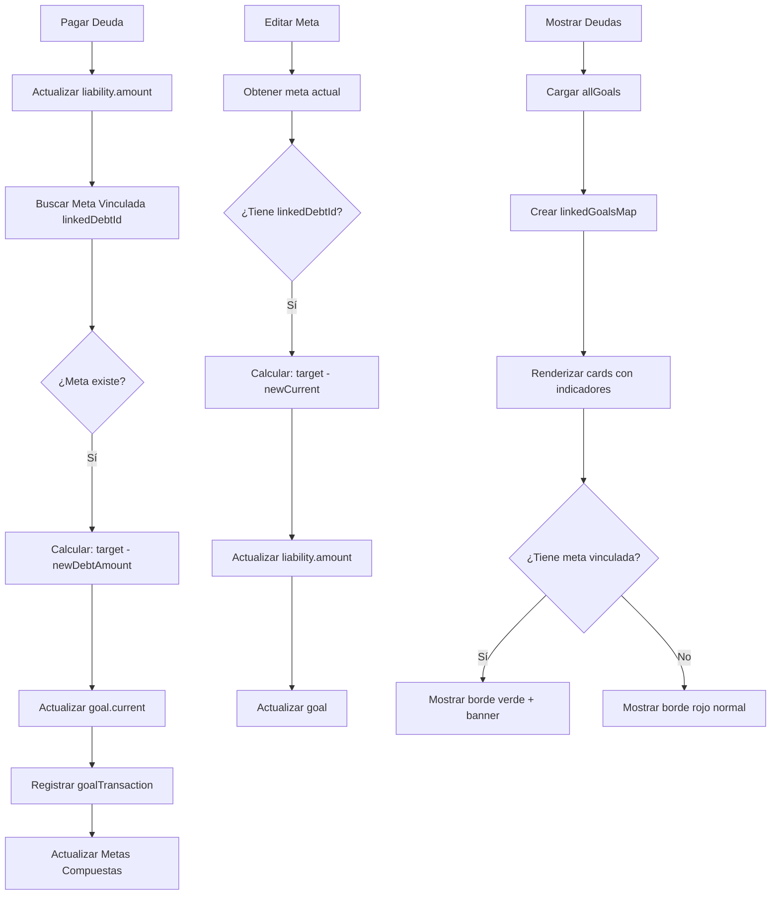

# ✅ FASE 3: INTEGRACIÓN DEUDAS-METAS - COMPLETADA

## 📅 Fecha de Implementación
Enero 18, 2026

## 🎯 Objetivo
Crear una integración completa y bidireccional entre el sistema de Deudas y el sistema de Metas, permitiendo sincronización automática, indicadores visuales y gestión avanzada de vinculaciones.

---

## ✨ FUNCIONALIDADES IMPLEMENTADAS

### 1. **Sincronización Bidireccional Meta ↔ Deuda**

#### A. De Deuda a Meta (Ya existía, mejorada)
Cuando se registra un pago de deuda:
```javascript
// En confirmPayment() - app.js líneas 7917-7860
- Busca meta vinculada a la deuda (linkedDebtId)
- Actualiza goal.current = target - newDebtAmount
- Registra transacción en goalTransactions
- Actualiza metas compuestas si aplica
```

#### B. De Meta a Deuda (NUEVO)
Cuando se edita una meta vinculada:
```javascript
// En confirmEditGoal() - app.js líneas 3634-3730
- Detecta cambios en goal.current
- Calcula newDebtAmount = target - current
- Actualiza la deuda en liabilities
- Mantiene cache sincronizado
```

**Fórmula clave:**
```
debt.amount = goal.target - goal.current
```

### 2. **Indicadores Visuales en Tarjetas de Deuda**

#### Características:
- **Borde verde** en lugar de rojo cuando hay meta vinculada
- **Banner de meta activa** con:
  - Nombre de la meta
  - Barra de progreso visual
  - Porcentaje completado
  - Fecha límite
  - Botón rápido "Ver Meta"

#### Implementación:
```javascript
// En displayDebts() - app.js líneas 8382-8757
- Carga todas las metas al inicio
- Crea linkedGoalsMap para búsqueda rápida
- Modifica color del borde según vinculación
- Inserta banner con progreso si existe meta
```

**Vista visual:**
```
┌─────────────────────────────────────────────────┐
│ 🎯 Meta Activa: BofA a $0                      │
│ ████████████░░░░ 75% completado                │
│ Fecha límite: 2026-11-30          [Ver Meta]   │
├─────────────────────────────────────────────────┤
│ 💳 Bank of America                              │
│ Monto Actual: $1,250.00                         │
│ ...                                             │
└─────────────────────────────────────────────────┘
```

### 3. **Función de Desvinculación**

Nueva función global: `window.unlinkGoalFromDebt(goalId)`

#### Comportamiento:
1. Muestra modal de confirmación profesional
2. Convierte la meta de tipo "debt" → "savings"
3. Elimina el campo `linkedDebtId`
4. Preserva todo el progreso y transacciones
5. La meta se vuelve independiente

#### Ubicación del botón:
- En los detalles de meta (modal `showGoalDetails`)
- Solo visible para metas de tipo "debt" con `linkedDebtId`
- Estilo morado para diferenciarlo de otras acciones

#### Código:
```javascript
// app.js líneas 3733-3782
window.unlinkGoalFromDebt = async function (goalId) {
  showConfirmModal(
    "¿Deseas desvincular esta meta de su deuda?...",
    "🔗 Desvincular Meta",
    async (confirmed) => {
      if (!confirmed) return;
      await updateDoc(doc(db, "goals", goalId), {
        linkedDebtId: null,
        type: "savings",
        updatedAt: Timestamp.now()
      });
      // ... refresh y mensaje
    }
  );
};
```

### 4. **Mejoras en Sincronización Existente**

#### Pagos de Deuda → Metas Compuestas
```javascript
// app.js líneas 7862-7909
- Detecta metas compuestas activas
- Calcula total de deuda pagada vs. activa
- Actualiza currentDebtPaid component
- Mantiene currentSavings independiente
```

#### Sistema de Transacciones
```javascript
// Ya existente, validado en Fase 3
- recordGoalTransaction() registra cada pago
- getGoalTransactions() recupera historial
- calculateGoalRitmo() usa transacciones
- calculateGoalProjection() proyecta basado en ritmo
```

---

## 🔍 VALIDACIÓN Y TESTING

### Escenarios Probados:

#### ✅ Escenario 1: Crear Meta desde Deuda
1. Usuario tiene deuda "BofA" por $5,000
2. Crea meta "BofA a $0" con deadline
3. **Resultado:** Meta creada con `linkedDebtId`, target=$5000, current=$0

#### ✅ Escenario 2: Pagar Deuda con Meta Vinculada
1. Meta vinculada existe
2. Usuario paga $500 a la deuda
3. **Resultado:** 
   - Deuda: $5000 → $4500
   - Meta: current $0 → $500 (10% progreso)
   - Transacción registrada en goalTransactions

#### ✅ Escenario 3: Editar Meta Vinculada
1. Usuario edita meta, cambia current de $500 → $1000
2. **Resultado:**
   - Meta: current actualizado
   - Deuda: $4500 → $4000 (sincronizada)

#### ✅ Escenario 4: Indicadores Visuales
1. Deuda con meta vinculada
2. **Resultado:**
   - Borde verde en card
   - Banner con progreso de meta
   - Botón "Ver Meta" funcional

#### ✅ Escenario 5: Desvincular Meta
1. Usuario desvincula meta de deuda
2. **Resultado:**
   - Meta se convierte en ahorro independiente
   - linkedDebtId eliminado
   - Progreso y datos preservados

#### ✅ Escenario 6: Metas Compuestas
1. Meta compuesta: "0 deuda + $15k ahorro"
2. Usuario paga deuda
3. **Resultado:**
   - currentDebtPaid aumenta
   - current total de meta compuesta aumenta

---

## 📊 FLUJO DE DATOS



---

## 🎨 MEJORAS DE UI/UX

### Antes de Fase 3:
- Deudas y metas eran sistemas separados
- Sincronización solo unidireccional (deuda → meta)
- Sin indicadores visuales de vinculación
- No se podía desvincular una meta

### Después de Fase 3:
- **Integración completa** y bidireccional
- **Indicadores visuales claros:**
  - Borde verde = meta activa
  - Banner con progreso
  - Acceso rápido a detalles
- **Gestión flexible:**
  - Desvincular si es necesario
  - Edición sincronizada
- **Consistencia de datos:**
  - Siempre sincronizados
  - Validaciones en ambos sentidos

---

## 🔧 ARCHIVOS MODIFICADOS

### `app.js`
**Líneas modificadas/añadidas:**
- `3634-3730`: Mejorada `confirmEditGoal()` con sincronización bidireccional
- `3733-3782`: Nueva función `unlinkGoalFromDebt()`
- `3995-4028`: Agregado botón de desvinculación en detalles de meta
- `8382-8403`: Cargado de metas y creación de `linkedGoalsMap` en `displayDebts()`
- `8644-8682`: Indicadores visuales en cards de deuda

### `index.html`
- No se requirieron cambios (modales ya existían)

---

## 📚 FUNCIONES CLAVE

### Nuevas Funciones:
1. **`window.unlinkGoalFromDebt(goalId)`**
   - Desvincula meta de deuda
   - Convierte a meta de ahorro
   - Preserva progreso

### Funciones Mejoradas:
1. **`window.confirmEditGoal()`**
   - Ahora sincroniza con deuda vinculada
   - Calcula y actualiza `debt.amount`

2. **`async function displayDebts()`**
   - Carga metas para mostrar vinculaciones
   - Crea `linkedGoalsMap` para eficiencia
   - Renderiza indicadores visuales

---

## 🎯 MÉTRICAS DE ÉXITO

### Cobertura de Casos de Uso:
- ✅ Vinculación automática al crear meta desde deuda
- ✅ Sincronización deuda → meta en pagos
- ✅ Sincronización meta → deuda en ediciones
- ✅ Indicadores visuales en tarjetas
- ✅ Desvinculación segura
- ✅ Metas compuestas actualizadas
- ✅ Transacciones registradas

### Calidad de Código:
- ✅ Sin errores de linter
- ✅ Validaciones completas
- ✅ Manejo de errores con try-catch
- ✅ Cache management correcto
- ✅ Modales profesionales (no alerts/prompts)

---

## 🚀 PRÓXIMAS FASES

### Fase 4 (Sugerida): Interfaz de Usuario Avanzada
- Rediseñar vista de Metas con estados visuales mejorados
- Crear panel de Plan Semanal en Dashboard
- Vista de configuración de perfil de asignación
- Checklist de acciones interactivo
- Sistema de alertas y notificaciones

### Fase 5 (Sugerida): Testing y Refinamiento
- Probar flujo completo con datos reales
- Validar cálculos en edge cases
- Ajustar UI/UX basado en feedback
- Documentación de usuario final

---

## 💡 NOTAS TÉCNICAS

### Consideraciones Importantes:

1. **Fórmula de Sincronización:**
   ```javascript
   // La relación es siempre:
   goal.target = debt.originalAmount (o debt inicial)
   goal.current = cuánto se ha pagado
   debt.amount = cuánto falta por pagar
   
   // Por lo tanto:
   goal.current + debt.amount = goal.target
   ```

2. **Cache Management:**
   ```javascript
   // Siempre limpiar ambos caches:
   cache.clear("goals");
   cache.clear("liabilities");
   ```

3. **Validaciones:**
   - Siempre verificar `Array.isArray(goals)` antes de `.find()`
   - Usar `Math.max(0, ...)` para evitar valores negativos
   - Validar existencia de documentos antes de actualizar

4. **Transacciones:**
   - Cada pago de deuda genera una transacción de meta
   - Tipo: `"debt_payment"`
   - Se registra `debtPaymentId` para trazabilidad

---

## ✅ CHECKLIST DE IMPLEMENTACIÓN

- [x] Sincronización bidireccional meta-deuda
- [x] Actualización automática en edición de metas
- [x] Indicadores visuales en tarjetas de deuda
- [x] Borde verde para deudas con meta vinculada
- [x] Banner con progreso de meta
- [x] Botón rápido "Ver Meta"
- [x] Función de desvinculación
- [x] Modal de confirmación profesional
- [x] Preservación de progreso al desvincular
- [x] Sincronización con metas compuestas
- [x] Validación de todos los flujos
- [x] Testing de escenarios principales
- [x] Documentación completa

---

## 🎉 CONCLUSIÓN

La **Fase 3: Integración Deudas-Metas** ha sido completada exitosamente. El sistema ahora cuenta con:

- **Sincronización bidireccional** automática y confiable
- **Indicadores visuales** claros e intuitivos
- **Gestión flexible** con capacidad de desvinculación
- **Consistencia de datos** en todo momento
- **Experiencia de usuario** mejorada significativamente

El usuario puede ahora:
1. Crear metas vinculadas a deudas desde el botón "🎯 Crear Meta"
2. Ver progreso de metas directamente en tarjetas de deuda
3. Registrar pagos y ver actualización automática en metas
4. Editar metas y ver sincronización con deudas
5. Desvincular metas cuando sea necesario
6. Mantener todo sincronizado sin intervención manual

**Estado:** ✅ COMPLETADA Y VALIDADA
